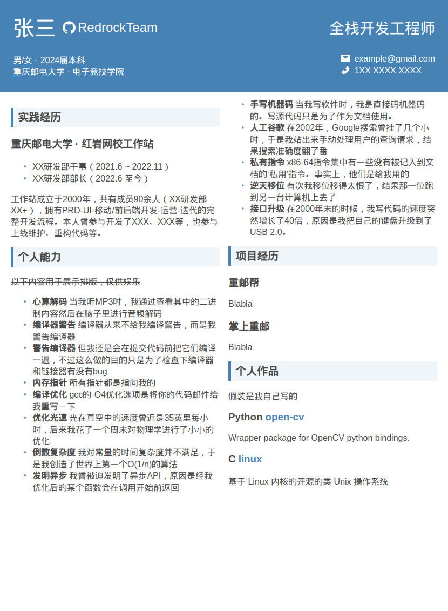

# CV Template

## Showcase

## How to use

1. Install dependencies: `npm install`;
1. Run `npm run preview` to see the initial rendering;
2. Edit `/template/info.jsonc` and `/template/content.md`, watching the changes until you get what you want;
3. Run `npm run print` to output the PDF file to `/target/cv.pdf`. 

## Features

- Hot Reload

