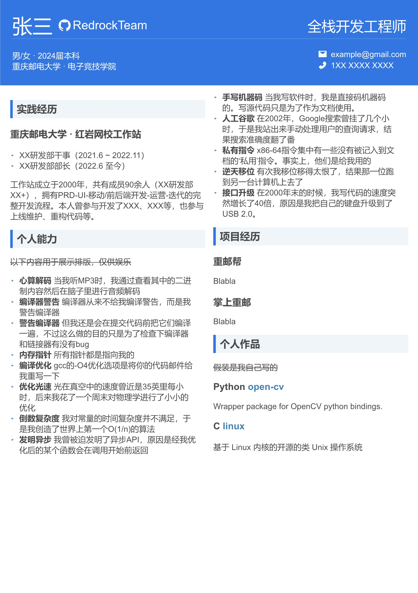
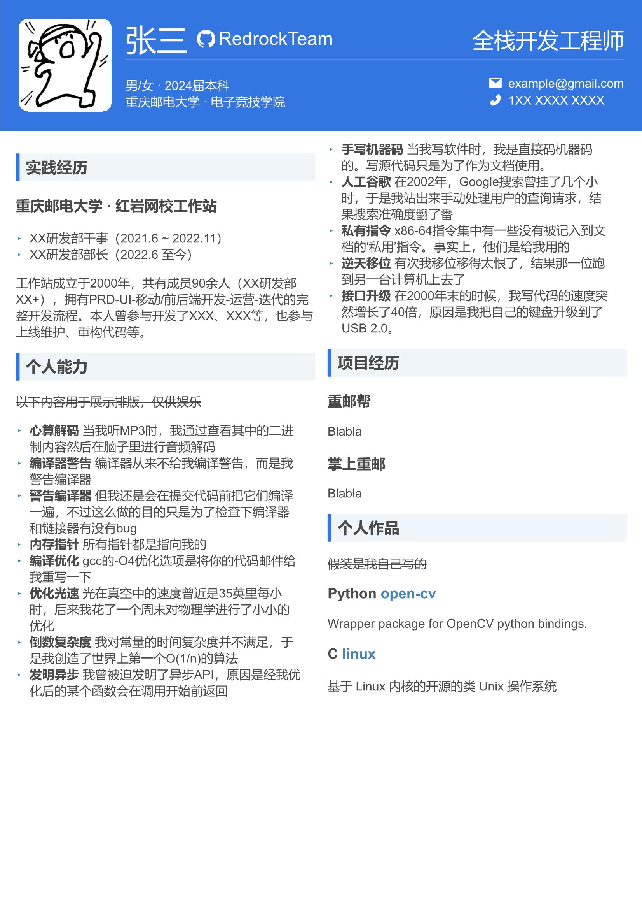

# CV Template

## Showcase

| Showcase Without Avatar                                     | Showcase With Avatar                                  |
| ----------------------------------------------------------- | ----------------------------------------------------- |
|  |  |

## Usage

### Setup

Install dependencies:

```command
npm install
```

### Edit & Preview

Launch the service:

```command
npm run preview
```

Then edit `/template/info.jsonc` and `/template/content.md`, watching the changes until you get what you want.


### Print
```command
npm run print
```
The output PDF file will be located at `/target/cv.pdf`. 

## Features

- Hot Reload

